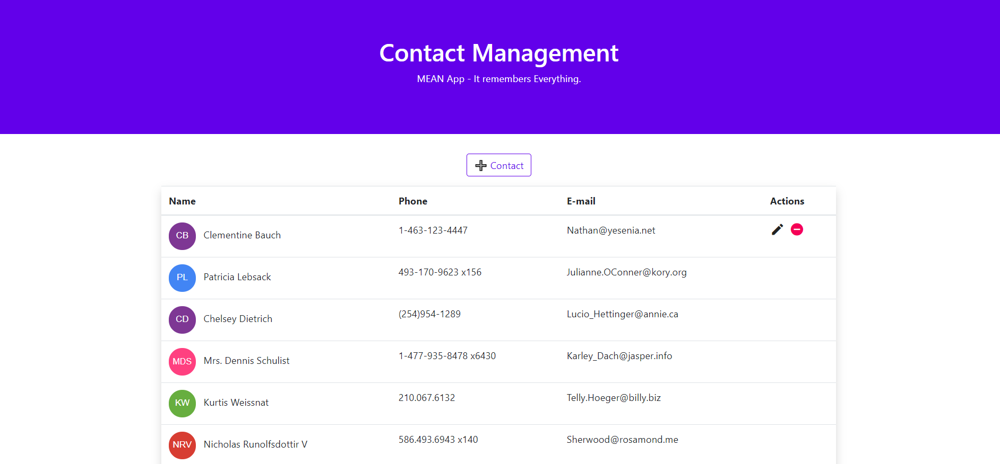

<h1 align="center">welcome to react redux contact management book 👋</h1>
<p>
  
  
</p>

> a react-redux contact management webapp to implement CRUD operation.

## 📸 screenshot



## 🛠 usage

```sh
$ git clone https://github.com/alok722/react-redux-contact.git

$ cd react-redux-contact

$ npm i

$ npm start
```

## 👤 author

**Alok raj (alokr417@gmail.com)**

- website: https://alokraj.tech/
- github: [@alok722](https://github.com/alok722)
- linkedin: [@alok722](https://linkedin.com/in/alok722)

## 🤝 contributing

contributions, issues and feature requests are welcome!

## 🙌 show your support

give a ⭐️ if this project helped you!

---
